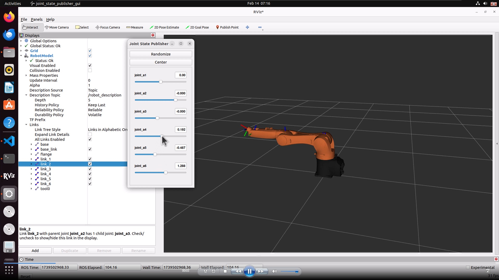

## KUKA-KR5-R900-Minimal-ROS2-Visualization

#### 🦾 Minimal mouse-controlled ROS 2 visualization of the KUKA KR5 R900 sixx industrial robot

This repository provides a **minimal ROS 2 package** that visualizes the **KUKA KR5 R900 sixx** robot in **RViz2** using a simple URDF and mouse-controlls. Quick, visual way to explore the robot model without setting up complex controllers or simulation environments.



### 📌 Features

- Minimalistic URDF-based KUKA KR5 R900 model
- Interactive 3D visualization via RViz2
- Mouse-controlled joint coordinates
- Clean and simple ROS 2 package structure
- Works out of the box with ROS 2 Humble and newer

> 🎥 **Watch on YouTube**: [Demo Video](https://youtu.be/zOlP1SSh640)


### 🚀 Getting Started

1. Ensure ROS2 Humble installed
2. Open Terminal in kuka-r900 folder
3. Run:
   ```bash
   colcon build --symlink-install --packages-select kuka-r900-description
   source install/setup.bash
   ros2 launch kuka-r900-description view_robot.launch.py


### 👨‍🔬 Applications

- Introductory ROS 2 robotics learning
- Quick visualization for robot URDF validation
- Industrial robot demos for classrooms or tutorials
- Lightweight base for further development (e.g., MoveIt2, Gazebo)


### 🧩 Related Projects

- More robotics content on our [YouTube channel](https://www.youtube.com/@hexakinetica)


### Contributing

We welcome contributions from the community! If you'd like to improve the models or add new functionality, please submit a pull request.

### Contact

Email: contact@hexakinetica.com
Website: https://www.hexakinetica.com


### Disclaimer

These models are not official KUKA models and are not affiliated with, endorsed by, or approved by KUKA Robotics. All trademarks, product names, and company names mentioned are the property of their respective owners.
The models are provided for visualization and educational purposes only and are not intended for manufacturing, engineering, or commercial use. The authors and distributors provide these models "as is" without any guarantee of accuracy, completeness, or fitness for any particular purpose.
If you are the copyright holder or believe any material posted violates your rights, please contact us to request removal.

### License
This project is licensed under the MIT License.
You are free to:
Use, copy, modify, merge, publish, distribute, sublicense, and sell copies of the software
Under the following terms:
The above copyright notice and this permission notice shall be included in all copies or substantial portions of the Software.
The software is provided "as is", without warranty of any kind, express or implied.
For more information, see the full license text: https://opensource.org/licenses/MIT
